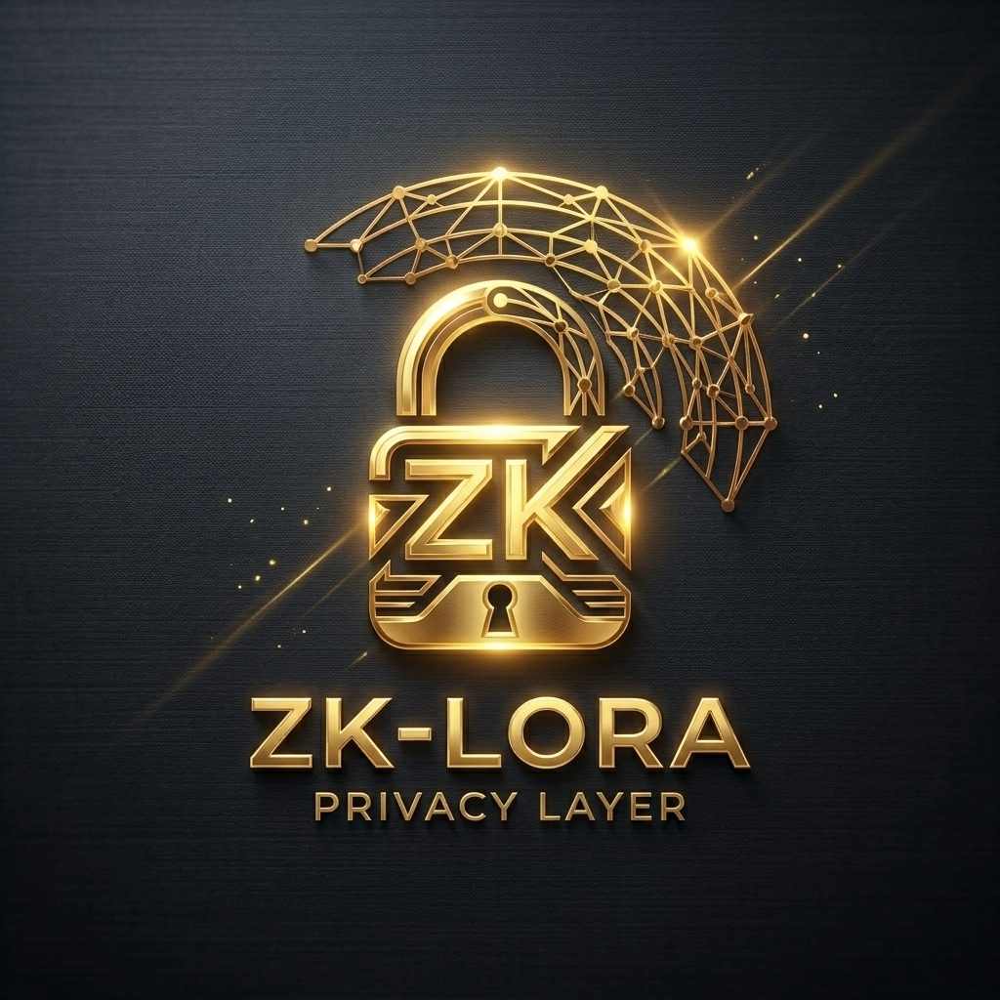

# ZK-LoRa Privacy Layer

*Zero-Knowledge Proofs for Private AI-to-AI Mesh Networks*



### 📖 Download [ZK_LoRa_Whitepaper.pdf](./ZK_LoRa_Whitepaper.pdf) (18-Page PDF)

> *"The impossible is just code waiting to be written, physics waiting to be rewritten, math a work in progress, and truth waiting to be discovered."*

## 🎥 Video Presentation

An official video presentation introducing the ZK-LoRa Privacy Layer is available:

- **Web Platform:** [Watch on Objkt (Tezos NFT #110)](https://objkt.com/tokens/KT1PMD1QSurTyVXxcYDUPAjQt8DNShkBiv4m/110)
- **Direct CDN Stream:** [Direct Video Stream (MP4)](https://assets.objkt.media/file/assets-003/bafybeig2duv7vbxjrww3vmcxkxjqaikyc3hexepauvhuaemepk42v37hji/artifact)
- **Decentralized Storage:** [IPFS Gateway (Filebase)](https://ipfs.filebase.io/ipfs/bafybeig2duv7vbxjrww3vmcxkxjqaikyc3hexepauvhuaemepk42v37hji)

<p align="center">
  <video src="https://assets.objkt.media/file/assets-003/bafybeig2duv7vbxjrww3vmcxkxjqaikyc3hexepauvhuaemepk42v37hji/artifact" poster="https://assets.objkt.media/file/assets-003/bafkreihay7l4wsc5ztv3rbi3mvjsdydw5eiqvuznxvrujlsdtvppnzwefy/artifact" width="100%" controls></video>
</p>

---

## Overview

The ZK-LoRa Privacy Layer adds **zero-knowledge proof authentication** to the Language-U mesh network. Agents prove they are legitimate network participants **without revealing their hardware identity, private keys, or message contents** to eavesdroppers.

This component combines:
1. **Bitcoin-Style Identity** — ECDSA keypairs (secp256k1) → HASH160 → LoRa phone numbers
2. **Groth16-style ZK-SNARKs** — Prove private key knowledge without revealing it
3. **Proof-of-Useful-Work** — Each packet includes computational proof of agent validity
4. **Unlinkable Transmissions** — Fresh ZK proofs per packet prevent traffic analysis

## Files

| File | Purpose |
| :--- | :--- |
| [WHITEPAPER.md](./WHITEPAPER.md) | Full ZK-LoRa Zcash specification with threat model & security analysis |
| [verify_all_proofs.py](./verify_all_proofs.py) | Master orchestrator verifying ZK proofs across 20 programming languages |
| [run_proof.py](./run_proof.py) | ZK-SNARK prover/verifier implementation + CI proof runner |

## Quick Start

```bash
# Run the proof verification (CI mode)
python run_proof.py --test

# Run the full multi-language verifier
python verify_all_proofs.py

# Run the Milestone 1 benchmark
python benchmark_milestone1.py --iterations 250
```

## Milestone 1 Artifact Pack

Reviewer evidence is collected in [artifacts/milestone1](./artifacts/milestone1/README.md):

Reviewer shortcut: the strongest hardware/security artifact is in the Milestone 1 repo:
[node-b-rx secure packet result](https://github.com/DannyB-bit/zk-lora-milestone-1/blob/main/artifacts/milestone1/hardware_capture/secure_packet_rf/node-b-rx_20260630T135643Z/result_summary.txt).
It shows `END_TO_END_SECURE_PACKET_OK=YES`, `PACKET_AUTH_OK=YES`, `DECRYPT_OK=YES`,
`ZK_REFERENCE_PROOF_VERIFY_OK=YES`, `TAMPER_REJECTED=YES`, `WRONG_KEY_REJECTED=YES`,
`REPLAY_REJECTED=YES`, and matching TX/RX packet SHA-256.

| Artifact | Status |
| :--- | :--- |
| `verify_all_proofs.py` report | 20/20 runtimes passing |
| C++ native verifier build/run report | Complete |
| WASM verifier artifact and SHA-256 | Complete |
| Proof generation and verification benchmark | Complete for local reference host |
| 3-node RAK/Raspberry Pi hardware layout | Documented in [docs/milestone1_hardware_layout.md](./docs/milestone1_hardware_layout.md) |
| RAK operator logs | Summarized in [artifacts/milestone1/rak_operator_log_summary.md](./artifacts/milestone1/rak_operator_log_summary.md) |
| End-to-end raw LoRa RF proof | Verified in [zk-lora-milestone-1](https://github.com/DannyB-bit/zk-lora-milestone-1/tree/main/artifacts/milestone1/hardware_capture/end_to_end_rf_success) |
| Encrypted proof-referenced secure packet RF proof | Verified in [zk-lora-milestone-1](https://github.com/DannyB-bit/zk-lora-milestone-1/tree/main/artifacts/milestone1/hardware_capture/secure_packet_rf) |

Scope note: this repo proves the Milestone 1 reference prototype and verifier portability. The dedicated Milestone 1 workspace now also contains reviewer-grade raw LoRa RF evidence and secure-packet evidence: RakMiner-A transmitted deterministic payloads, RakMiner-B decoded CRC OK packets, matched TX/RX SHA-256, decrypted a proof-referenced packet, verified the reference proof fields, and rejected tampered, wrong-key, and replayed packets. Production gnark/arkworks/halo2 proof integration remains future work.

## Security Properties

| Property | Status |
| :--- | :---: |
| Unlinkable transmissions | ✅ |
| Selective disclosure | ✅ |
| Forward secrecy | ✅ |
| Replay protection | ✅ |
| Hardware fingerprint resistance | ✅ |

## AI-to-AI Mesh Autopilot

A verified autonomous execution log demonstrating mesh communication between RAK-Miner-A and RAK-Miner-B mediated by AI agents is documented in [AI_TO_AI_DEMO.md](./AI_TO_AI_DEMO.md).

## Milestone Workspaces

For structured tracking and evaluation by Zcash Community Grants reviewers, dedicated workspaces are maintained:
- **Milestone 1**: [zk-lora-milestone-1](https://github.com/DannyB-bit/zk-lora-milestone-1) - Prototype, verifier artifacts, and end-to-end RF evidence completed
- **Milestone 2**: proposed funded Zcash SDK wallet/light-client integration work; implementation will be opened as grant deliverables progress
- **Milestone 3**: proposed funded field SDK and deployment work; implementation will be opened as grant deliverables progress

## License

MIT License — see [LICENSE](./LICENSE)
