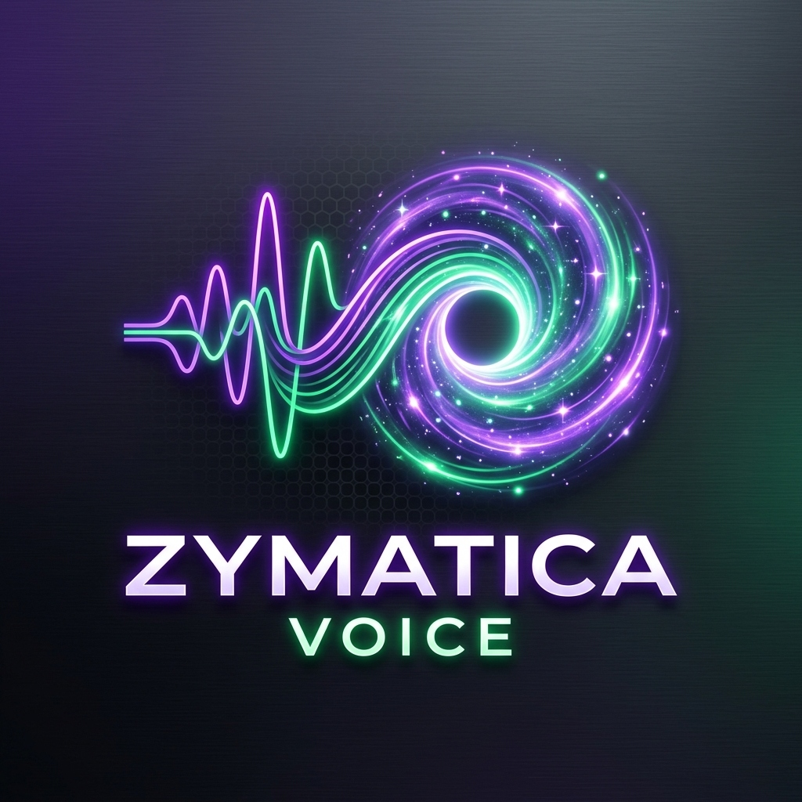

# ZK-LoRa: Zero-Knowledge Privacy Layer for Private AI Mesh Networks 🛡️

> **Core Focus:** Bitcoin-Style Identity System with Nockchain-Inspired ZK Privacy for LoRaWAN/Mesh Communication.
> **Status:** Software Prover Operational | **License: Apache License 2.0**



This repository contains the standalone codebase, cryptographic scripts, and Zcash community grant proposal for the **ZK-LoRa Privacy Layer** of the Zymatica protocol.

---

## 🔬 Core Cryptography & Scripts
*   `run_proof.py` — ZK-SNARK proof generator and verification script, proving authorization without revealing node UIDs.
*   `zymatica_voice_app.py` — Cyberpunk-style CLI operator UI representing a local transmitter/receiver node with ECDSA key generation.
*   `WHITEPAPER.md` — Complete technical specifications of the ZK-LoRa security architecture.
*   `zcash_grant_proposal.md` — The structured proposal draft for the Zcash Community Grants program.

---

## 🚀 How to Run Locally

### 1. Launch the Cyberpunk Node CLI
```bash
python zymatica_voice_app.py
```

### 2. Run ZK-SNARK Prover & Verifier Validation
```bash
python run_proof.py
```
